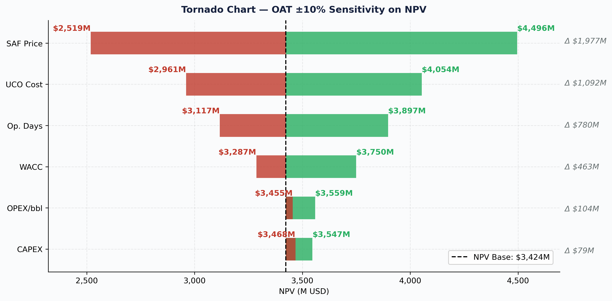
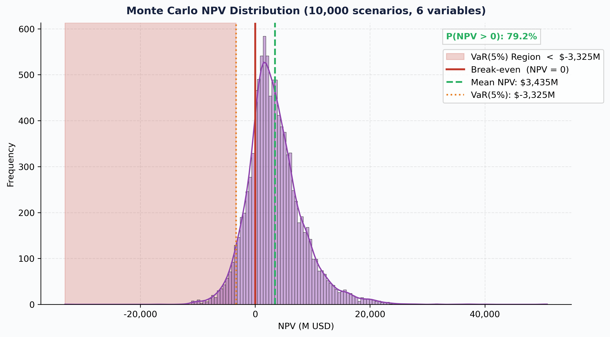

# SAF Bio-Refinery | Capital Budgeting & Risk Analysis

> A $3.4B NPV and a VaR(5%) of −$3.3B in the same model.  
> That's what peak-cycle commodity pricing looks like through a proper risk engine.

## Overview

Quantitative financial model built in Python to evaluate the conversion of a 
conventional refinery into a **Sustainable Aviation Fuel (SAF / HEFA)** plant.  
Stress-tested against a real war-time scenario: Middle East conflict, March 2026.

Developed as a portfolio project combining **Petroleum Engineering** domain knowledge 
with the **Corporate Finance Specialization** (Coursera) and **Data Science** tools.

---

## Key Results — War-Time Scenario (March 2026)

| KPI | Value |
|---|---|
| NPV (Base Case) | $3,423.5M USD |
| IRR | 103.91% |
| Payback Period | 1.08 years |
| Break-Even SAF Price | $245.2/bbl |
| Min DSCR | 18.75x |
| Monte Carlo Mean NPV | $3,434.9M |
| P(NPV > 0) | 79.2% |
| VaR (5th percentile) | −$3,325.0M |
| Hedged Crack Spread Floor | $57/bbl |

---

## Model Architecture
Module 1 — Dynamic WACC via CAPM (yfinance API: Beta, Rf, Rm)
Module 2 — Vectorized FCF model: P&L → NOPAT → FCF → DSCR
Module 3 — Risk Engine: Sensitivity (meshgrid) + Monte Carlo (6 variables)
— Hedging: Black-Scholes Zero-Cost Collar (UCO Leg + SAF Leg)
Module 4 — 8 standalone high-resolution charts (300 DPI PNG)

## Charts




---

## How to Run
```bash
# 1. Clone the repository
git clone https://github.com/cesar-avp/SAF-BioRefinery-CapitalBudgeting.git

# 2. Install dependencies
pip install -r requirements.txt

# 3. Open in Spyder or Jupyter and run cells in order
# Edit INPUT A, B, C sections to change the scenario
```

---

## Tech Stack

`Python 3.10` · `Pandas` · `NumPy` · `NumPy Financial` · `SciPy` · 
`yfinance` · `Matplotlib` · `Seaborn`

---

## Author

**César A. V. P.**  
Petroleum Engineer | Data Analyst Junior  
[LinkedIn](https://www.linkedin.com/in/cesar-avp)

---

## References

- S&P Global Commodity Insights. (2026). European SAF market dynamics.
- Fastmarkets. (2026). UCO CIF ARA price assessments.
- Hull, J. C. (2021). *Options, Futures, and Other Derivatives* (11th ed.). Pearson.
- IEA. (2026). Oil Market Report — March 2026.
- European Commission. (2023). ReFuelEU Aviation Initiative.